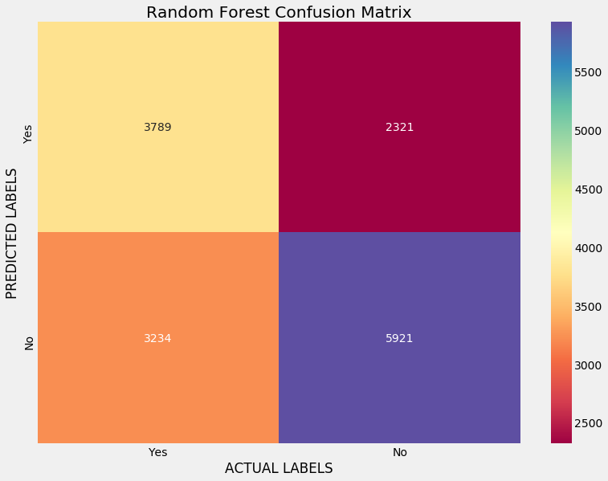

# Diabetes Re-hospitalizations

## Introduction:

Diabetes affects approximately 29 million adults and children in the United States.  According to the American Diabetes Association, the cost associated with diagnosed diabetes was $245 billion in 2012, making the single most expensive medical condition. Out of that number, around 43% is related to direct hospital admissions. The break down of diabetes costs in the United States is greater than $13,500 per year. Of that amount, almost $8k is specifically for diabetes care. With the cost of care rising, it is becoming more and more important to ease the burden of the individual and the health system in general. 

## Goal:

Given the high cost of hospitalization, how can we use data science tools to reduce the number of patients being re-admitted after a being hospitalized for complications from diabetes? The goal is to predict how likely someone is to be re-admitted based on available data of diabetes patient records. A number of features will be taken into account, such as age, gender, race, medications, lab procedures, etc.
Predicting Diabetes Re-hospitalization

## Data:

The data are submitted on behalf of the Center for Clinical and Translational Research, Virginia Commonwealth University. Provided by UCI https://archive.ics.uci.edu/ml/datasets/Diabetes+130-US+hospitals+for+years+1999-2008# It represents 10 years (1999-2008) of clinical care at 130 US hospitals and integrated delivery networks. It includes over 50 features representing patient and hospital outcomes.  Information was extracted from the database for encounters that satisfied the following criteria.
 -It is an inpatient encounter (a hospital admission).
 -It is a diabetic encounter, that is, one during which any kind of diabetes was entered to the system as a diagnosis.
 -The length of stay was at least 1 day and at most 14 days.
 -Laboratory tests were performed during the encounter.
 -Medications were administered during the encounter.
The data contains such attributes as patient number, race, gender, age, admission type, time in hospital, medical specialty of admitting physician, number of lab test performed, HbA1c test result, diagnosis, number of medication, diabetic medications, number of outpatient, inpatient, and emergency visits in the year before the hospitalization, etc.

## Exploratory Data Analysis

Breakdown by Age:

Breakdown by Race:

Average Number of Meds:

Average Number of Procedures:

Feature Importances:

## Data Pipeline:
1. Loaded data into a Pandas data frame.
2. Cleaned and organized data.
3. Created dummy variables for categorical features.
4. Exploratory Data Analysis
5. Selected models: Logistic Regression, Random Forest Classifier, and Gradient Boosting Classifier.
6. Tested base models.
7. Performed grid searches on the models.
8. Tested optimized models and compared to base.

# Model Performance:

Logistic Regression

Random Forest

Gradient Boosting

# Confusion Matrices:

Random Forest

Gradient Boosting

# ROC Curves:

Logistic Regression

Random Forest

Gradient Boosting

## Conclusion:

The metric of interest in this case was the F1 Score because it combines both Precision and Recall. Since we do know have enough information about which one of the two is more important, the F1 Score accounts for both. Out of the base models, Gradient Boosting performed the best. After performing grid searches on the models and finding the optimum hyperparameters, Gradient Boosting came out on top again, though the improvement was miniscule.

## Next Steps:

  -Test a basic neural network. One was built, but given the time constraint it wasn't tested.
  -Find a bigger data set to test the models on. 
